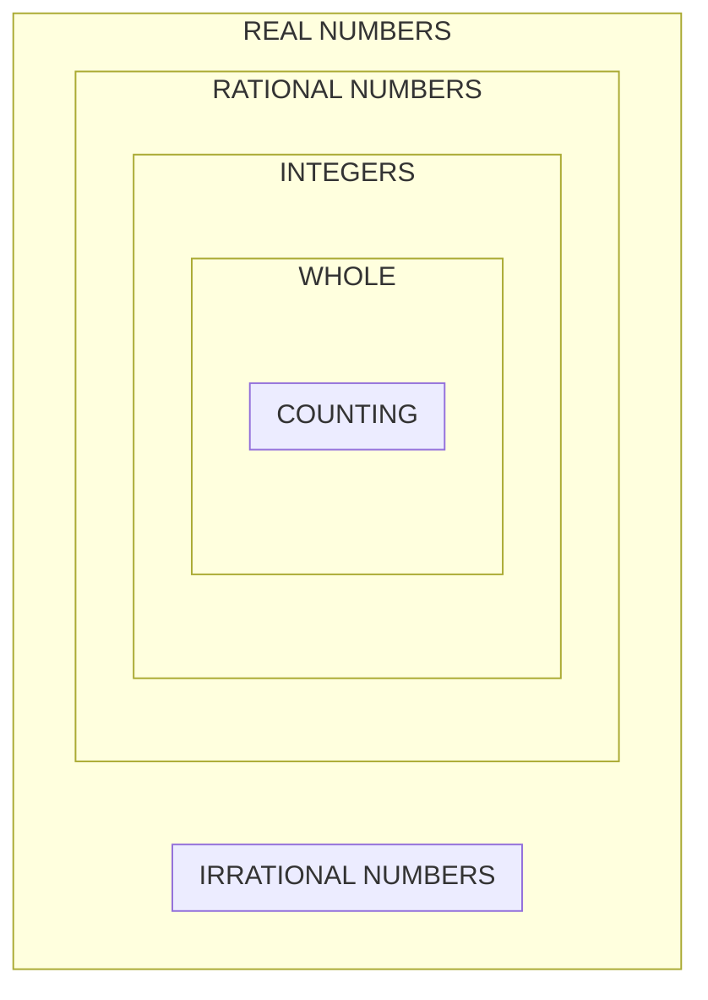
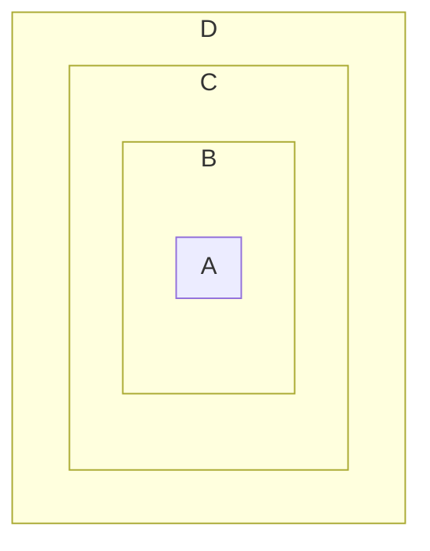

# Numbers

| Type       | Example                                                      |
| ---------- | ------------------------------------------------------------ |
| Counting   | 1,2,3,4,5,...                                                |
| Whole      | 0,1,2,3,4,5,...                                              |
| Integers   | ...,-3,-2,-1,0,1,2,3,...                                     |
| Rational   | $\frac{a}{b}$, $\frac{10}{1}$, $\frac{1}{3}$, $\frac{-1}{2}$ |
| Irrational | $\pi$, $\sqrt{3}$, **NOT** $\frac{a}{b}$                     |
| Real       | Both Rational and Irrational Numbers                         |

/newline

# Numbers Practice

